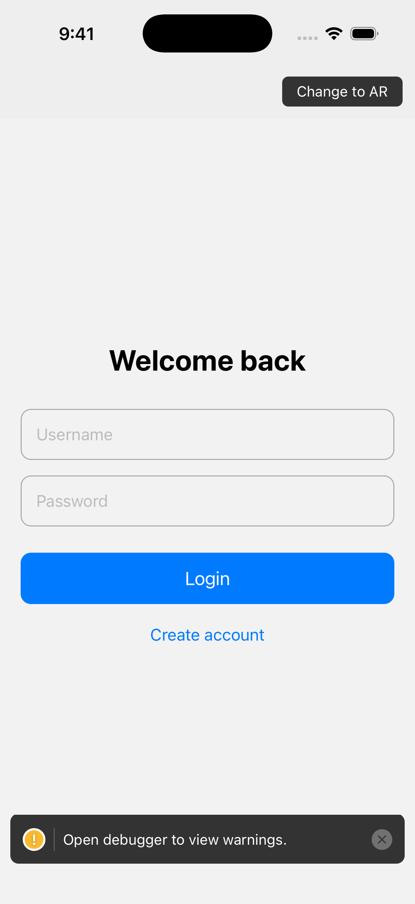
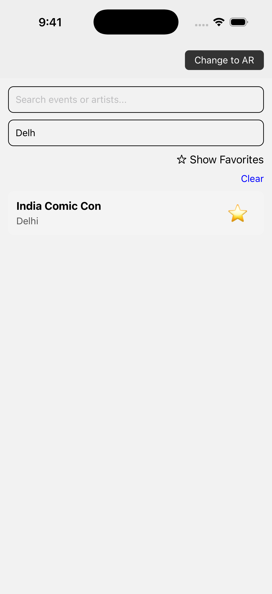
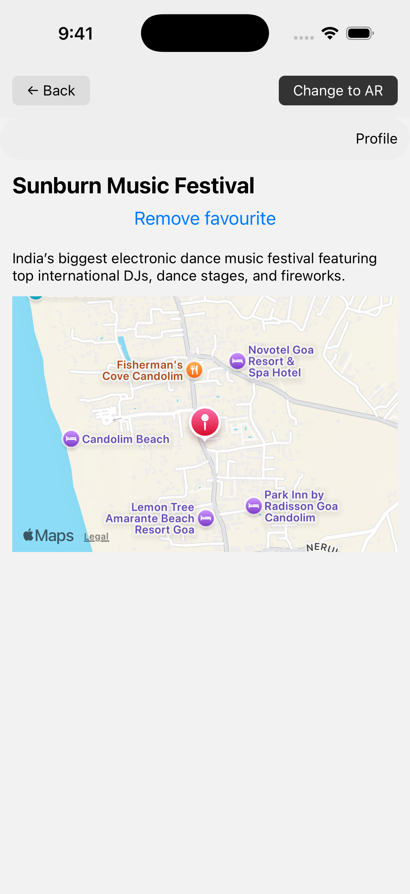
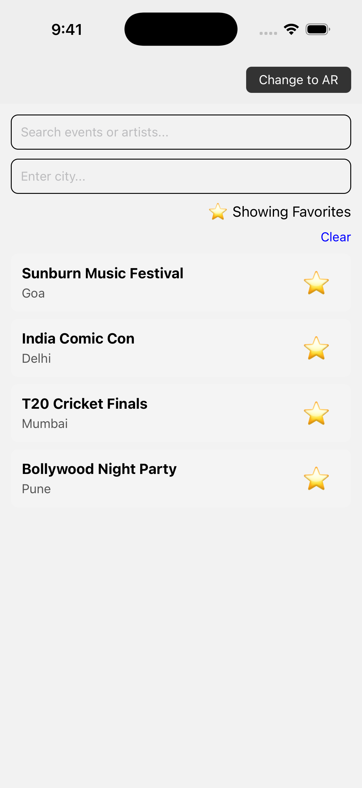
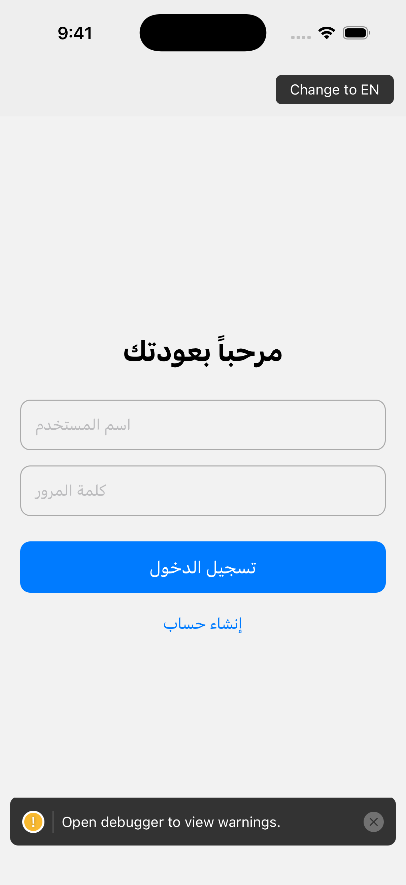
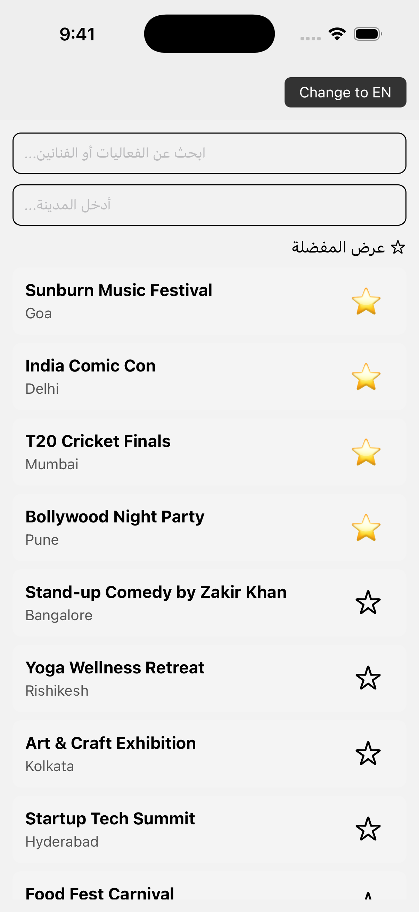

# CityPulse

A React Native app to City Pulse – Local Events Explorer.
## Setup
1. `git clone https://github.com/djdheeraj53/CityPulse.git`
2. `cd CityPulse`
3. `npm install` or `yarn install`
4. Run project: `npx react-native run-ios` or `npx react-native run-android`

## Features
- Login/Signup with AsyncStorage persistence
- Home screen with search, filter, and favorites
- Event details with map & favorites
- Profile screen showing logged-in user
- Language toggle (English / Arabic)

## Assumptions
- User data is saved locally only
- Favorites are persisted in AsyncStorage

### Screenshots

**Home Screen**  

**Event Details Screen**  
## Login Screen

## Home Screen (Event and Search)

## Filter List

## Event Detail

## Favorites Event List

## Arabic Login Screen

## Arabic Home Screen

